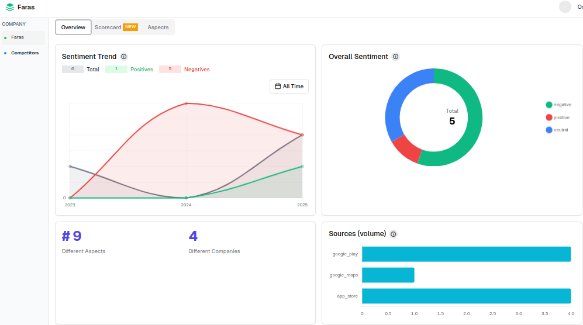
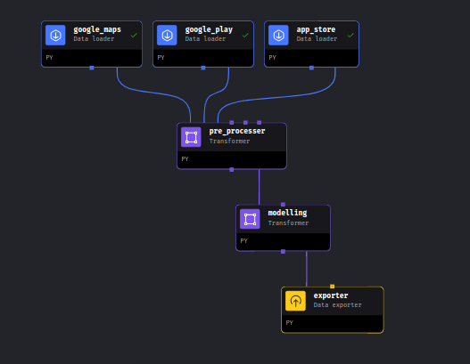

# Faras Sentiment Analysis 🚖📊

   

An end-to-end pipeline to analyze customer sentiment for Faras Kenya and competitors (Uber, Bolt, Little Cab) 

---

## 📌 Project Overview
**Goal**: Compare sentiment trends across ride-hailing platforms in Kenya to identify competitive insights.  
**Key Features**:
- Scraped **50,000+ reviews** from multiple sources  
- Aspect-based sentiment analysis (pricing, driver behavior, app usability)  
- Automated pipeline with **Mage AI**  
- Real-time dashboard  



---
---

## 📈 Business Understanding

The ride-hailing market in Kenya is highly competitive, with companies like Uber, Bolt, Little Cab, and Faras all vying for market share. Understanding **customer sentiment** can reveal pain points and strengths that affect customer loyalty and app retention.

**This project aims to:**
- Identify what aspects customers care most about (e.g., price, driver behavior, app reliability).
- Benchmark Faras against its competitors using real user feedback.
- Enable data-driven product and marketing decisions through sentiment trends.
- Monitor public perception over time to assess impact of feature rollouts or service changes.

> With these insights, Faras can gain a **competitive edge** by addressing customer concerns faster and more strategically.

---


## 📂 Data Sources
[](https://play.google.com) | [](https://www.apple.com/app-store) | [](https://maps.google.com)
--- | --- | ---
[Google Play](https://play.google.com) | [App Store](https://www.apple.com/app-store) | [Google Maps](https://maps.google.com)


**Sample Review**:
```python
{
  "review_id": "abc123",
  "text": "Driver was polite but app crashed",
  "rating": 3,
  "source": "Google Play",
  "date": "2023-10-01",
  "company": "Faras"
}
```
## ⚙️ Pipeline Architecture

## 🧠 Modeling

We used powerful pretrained models from 🤗 [Hugging Face](https://huggingface.co/) to analyze customer reviews:

### 🔍 Models Used

- **Zero-shot Classification**  
  [`facebook/bart-large-mnli`](https://huggingface.co/facebook/bart-large-mnli)  
  → Detects custom topics like "pricing", "support", or "app issues".

- **Aspect-Based Sentiment Analysis (ABSA)**  
  [`yangheng/deberta-v3-base-absa-v1.1`](https://huggingface.co/yangheng/deberta-v3-base-absa-v1.1)  
  → Finds sentiment for specific aspects like driver behavior or app performance.

- **General Sentiment Analysis**  
  [`cardiffnlp/twitter-roberta-base-sentiment`](https://huggingface.co/cardiffnlp/twitter-roberta-base-sentiment)  
  → Classifies reviews as Positive, Neutral, or Negative.

- **Emotion Detection**  
  [`SamLowe/roberta-base-go_emotions`](https://huggingface.co/SamLowe/roberta-base-go_emotions)  
  → Detects emotions like Joy, Anger, Sadness, etc.

Each model is used via the `pipeline()` method from the `transformers` library for easy integration.

```python
from transformers import pipeline

self.zero_shot = pipeline("zero-shot-classification", model="facebook/bart-large-mnli")
self.absa = pipeline("text-classification", model="yangheng/deberta-v3-base-absa-v1.1")
self.sentiment = pipeline("text-classification", model="cardiffnlp/twitter-roberta-base-sentiment")
self.emotion = pipeline("text-classification", model="SamLowe/roberta-base-go_emotions")
```
## Usage

1. **Installation**

    ```bash
    git clone https://github.com/yourusername/filmcraze-recommender.git
    ```
2. **Getting Started**
    ```bash
    # create a virtual environment
    Virtualenv Env
   ```
    ```bash
    source Env/bin/activate
   ```
    ```bash
    pip install -r requirements.txt
   ```
   ```bash
    cd filmcraze-recommender
    ```
   ```bash
    # run the pipeline
    mage start ETL
   ```
3. **Setting Database**
   ```bash
    export const sql = neon("postgresql://neondb_owner:"#use your url)
  ```
```
## 🚀 Deployment
[](https://faras-sentiment.vercel.app) 
[](https://neon.tech)


